# FEDrill · 架构总览

> 版本 v2.0 · 2026-09-05
>
> 定位：**面试复习入口文档**。按"层 × 数据流 × Agent 设计"三视角组织，覆盖 M1 → M2a Phase 1a → 沙箱红队 Step 5 → BYOK 全部现状。
>
> 配套：[项目调研.md](项目调研.md)（战略）· [需求方案.md](需求方案.md)（PRD）· [技术方案.md](技术方案.md)（实现蓝图）· [roadmap-m2.md](roadmap-m2.md)（M2 计划）

---

## 0 · 索引

**A · 全局**
- [1 · 项目当前进度快照](#1--项目当前进度快照)
- [2 · 分层总览（六层）](#2--分层总览六层)
- [3 · 目录结构](#3--目录结构)

**B · 每层详细架构**
- [4 · UI 层 · 组件与状态](#4--ui-层--组件与状态)
- [5 · Agent 层 · 客户端 Loop + Prompt + Tool](#5--agent-层--客户端-loop--prompt--tool)
- [6 · LLM Provider 层 · 抽象与 DeepSeek Adapter](#6--llm-provider-层--抽象与-deepseek-adapter)
- [7 · 数据层 · SessionRepo + BYOK](#7--数据层--sessionrepo--byok)
- [8 · 沙箱层 · Web Worker + 红队防御](#8--沙箱层--web-worker--红队防御)
- [9 · 质量层 · Vitest + Playwright](#9--质量层--vitest--playwright)

**C · 端到端数据流**
- [10 · 流量 1 · 用户手动跑测试](#10--流量-1--用户手动跑测试)
- [11 · 流量 2 · Agent 主动 tool_call（M2a 核心）](#11--流量-2--agent-主动-tool_callm2a-核心)
- [12 · 流量 3 · AbortController 端到端中断](#12--流量-3--abortcontroller-端到端中断)
- [13 · 流量 4 · BYOK 密钥流](#13--流量-4--byok-密钥流)

**D · 面试**
- [14 · 关键设计决策矩阵（11 份 ADR）](#14--关键设计决策矩阵11-份-adr)
- [15 · 面试话术钩子（速查）](#15--面试话术钩子速查)
- [16 · 记忆锚点表](#16--记忆锚点表)

---

## 1 · 项目当前进度快照

**进度**（2026-09-05）：
- ✅ **M1**：手撕题单题闭环 · 5 道预置题 · Round 0 上下文注入 Agent
- ✅ **M2 Phase 0**：SessionRepo + Vitest 单测 + Playwright 骨架 + ADR-009/010
- ✅ **M2a Phase 1a**：Agent Loop v1 端到端 + `run_tests` tool + Provider 抽象 + Round 1 prompt
- ✅ **沙箱红队 Step 5**：RT-01~04 全部落地 · RT-03 shadow + nonce 双层防御
- ✅ **BYOK**：访客自带 DeepSeek API Key · 零成本上线演示站
- 🚧 **M2a Phase 1b**：Trace UI 深化 · Round 0↔1 回退兜底
- 📅 **M2a 硬锁**：2026-09-15

**简历三条硬亮点**（已锁）：
1. **手写 LLM Harness** —— SSE 帧解析 + AbortController 端到端 + Provider 抽象层（可换 Claude）
2. **手写 Agent Loop（客户端跑）** —— ADR-011 + ReAct 循环 + `role='tool'` 消息 + `MAX_ITERATIONS=10`
3. **Web Worker 沙盒 + 红队防御** —— 3s `terminate` + `{__fn}/{__val}` escape hatch + shadow + nonce 反逃逸

---

## 2 · 分层总览（六层）

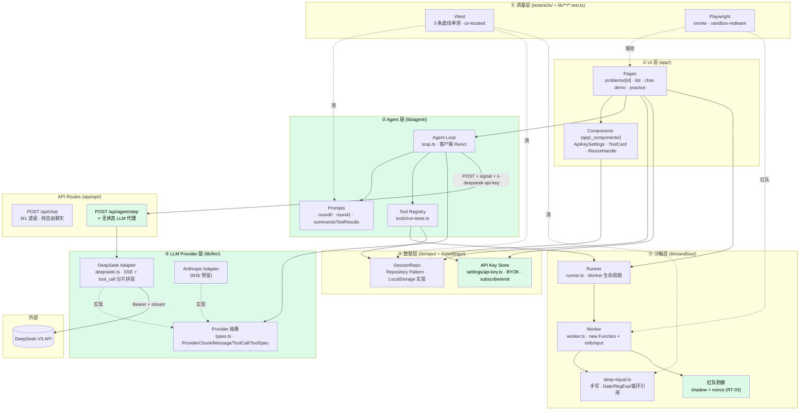

**六层的角色分工**：
- **UI 层**：拼装 + 事件转发 · 唯一 `'use client'` 的层
- **Agent 层** ⭐ **新层**：ReAct 循环 · Prompt 拼装 · Tool 定义 · 都在客户端
- **Provider 层** ⭐ **新层**：LLM 协议差异吸收器 · Agent 层依赖抽象 · 服务端和 Agent 共用
- **数据层**：SessionRepo（会话）+ ApiKey Store（BYOK）· 都在 localStorage
- **沙箱层**：M1 打底 · Step 5 加了 shadow + nonce 防御
- **质量层**：横切三层 · Vitest 测纯函数 · Playwright 测链路 + 红队

---

## 3 · 目录结构

```
fedrill/
├── app/
│   ├── _components/                ⭐ 新
│   │   └── api-key-settings.tsx    ⭐ BYOK UI
│   ├── api/
│   │   ├── chat/route.ts           M1 遗留 · 纯聊天
│   │   └── agent/step/route.ts     ⭐ 无状态 LLM 代理
│   ├── problems/
│   │   ├── page.tsx                题库列表
│   │   └── [id]/page.tsx           三区详情页 · 唯一 client · 800 行
│   ├── chat-demo/page.tsx
│   ├── practice/page.tsx
│   ├── dev-sandbox-test/           ⭐ 沙箱红队页面
│   ├── layout.tsx / page.tsx
│   └── globals.css
│
├── lib/
│   ├── agent/                      ⭐ 内容扩充
│   │   ├── loop.ts                 ⭐ Agent Loop 主体 · 244 行
│   │   ├── round0-prompt.ts        Round 0 · 4 布尔 + 4 分支
│   │   ├── round0-prompt.test.ts
│   │   ├── round1-prompt.ts        ⭐ Round 1 · 边界追问
│   │   └── tools/
│   │       └── run-tests.ts        ⭐ M2a 唯一 tool
│   ├── llm/                        ⭐ 新目录
│   │   ├── types.ts                ⭐ Provider 抽象契约
│   │   └── deepseek.ts             ⭐ DeepSeek adapter
│   ├── repo/
│   │   ├── session-repo.ts
│   │   └── session-repo.test.ts
│   ├── settings/                   ⭐ 新目录
│   │   └── api-key.ts              ⭐ BYOK · subscribe/emit
│   ├── sandbox/
│   │   ├── runner.ts
│   │   ├── worker.ts
│   │   ├── deep-equal.ts
│   │   ├── deep-equal.test.ts
│   │   └── types.ts
│   └── types/
│       └── problem.ts
│
├── data/problems/                  5 道题
│
├── tests/e2e/
│   ├── smoke.spec.ts
│   └── sandbox-redteam.spec.ts     ⭐ RT-01~04 断言
│
├── docs/
│   ├── decisions/                  11 份 ADR (ADR-011 ⭐ 新)
│   ├── learning/                   8 篇学习笔记
│   ├── roadmap-m2.md
│   ├── 项目调研.md 需求方案.md 技术方案.md 学习规划.md
│   └── 架构总览.md                 本文档
│
├── playwright.config.ts
└── package.json                    +deepseek-related; -no vercel ai sdk
```

---

## 4 · UI 层 · 组件与状态

### 4.1 页面组件树

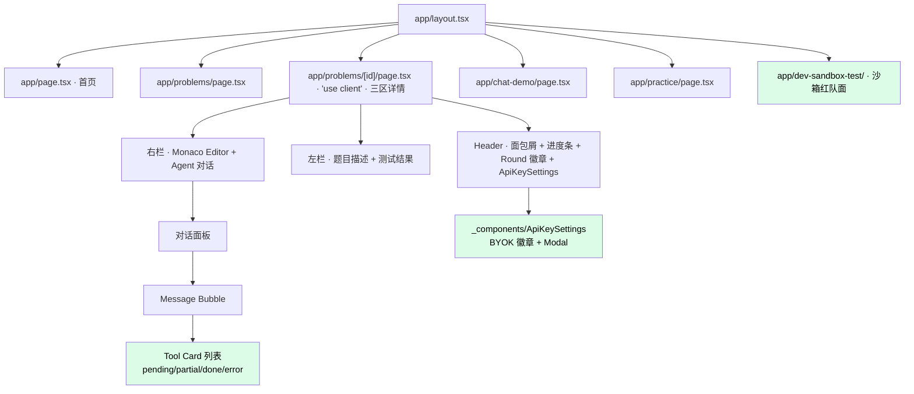

### 4.2 关键 state（[app/problems/[id]/page.tsx](../app/problems/[id]/page.tsx)）

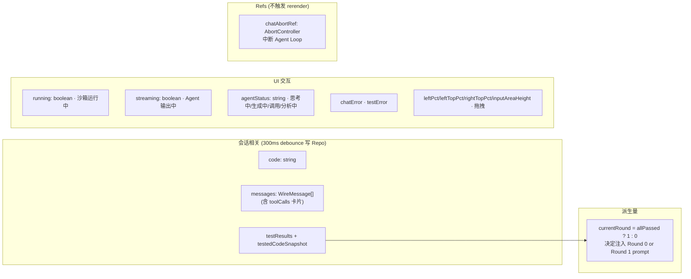

**关键设计点**：
- **`currentRound` 是派生量不是 state** —— 单一事实源是 `testResults`，避免"currentRound 存了 state 但和实际测试结果不同步"的双源风险
- **`chatAbortRef` 用 ref 不用 state** —— AbortController 变化不需要触发 rerender
- **Monaco `Ctrl+Enter` 陈旧闭包** —— 修复见 `7376918`，用 `useLatestRef` 模式解，避免 keyBinding 抓到旧的 `runTests` 引用

### 4.3 Tool Card 状态机

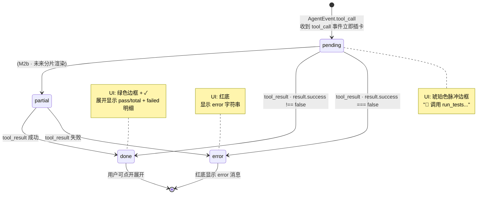

**UI 交互细节**（`13145a6` + `e23b588`）：
- **卡片化替代行内 emoji**：过去 tool_call 是文本里的 "🔧 run_tests" —— 改成独立卡片，pending/done/error 用颜色区分
- **中断按钮 streaming 红底脉冲**：streaming 时让"中断"按钮变红脉冲，用户视觉焦点直接锁在"能中断"这件事上

---

## 5 · Agent 层 · 客户端 Loop + Prompt + Tool

### 5.1 Agent Loop 主控（[lib/agent/loop.ts](../lib/agent/loop.ts)）

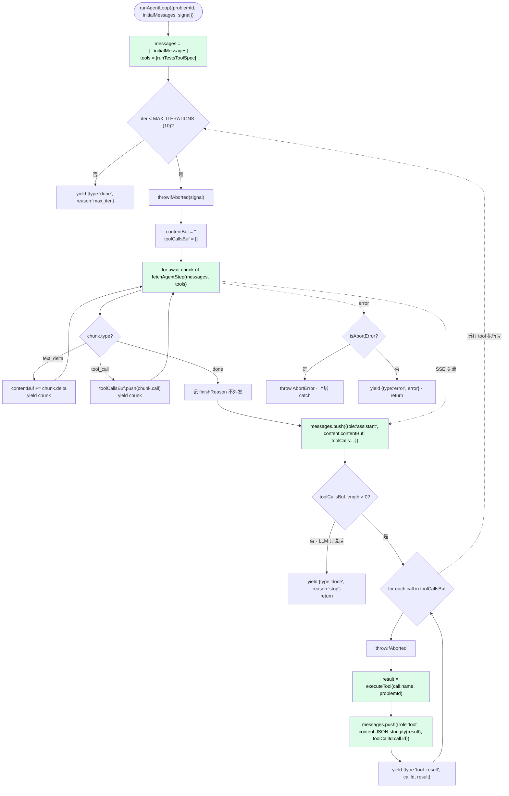

**5 种对外事件**（`AgentEvent`）：

| 事件 | 时机 | UI 反应 |
|---|---|---|
| `text_delta` | LLM 正在流式说话 | 追加到当前 assistant 气泡 |
| `tool_call` | LLM 决定调 tool（拼装完毕的完整 call） | 插入 pending Tool Card |
| `tool_result` | 客户端执行完 tool 返回结果 | 更新对应 Card 为 done/error |
| `done` | Loop 正常结束（`stop`）或强制终止（`max_iter`） | 释放 streaming 状态 |
| `error` | 网络/上游异常（非 abort） | 显示错误提示 |

### 5.2 Prompt 分层（Round 0 vs Round 1）

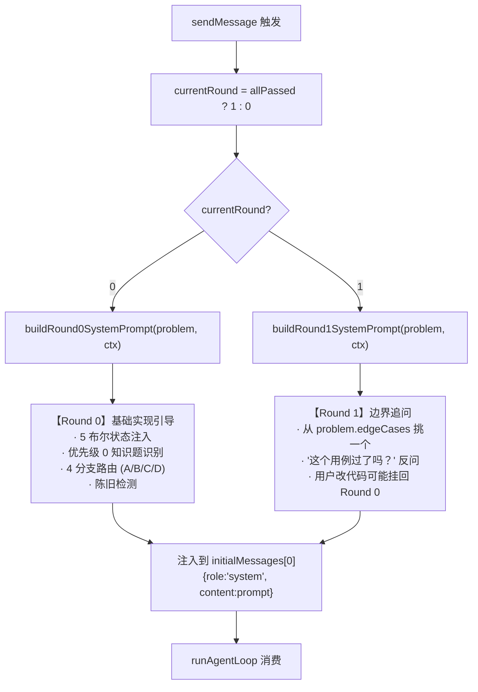

**Prompt 是客户端组装的**（不是服务端）—— 因为 ADR-011 让服务端保持无状态，Prompt 由 UI 组装后连同 `messages` 一起 POST 出去。这也是为什么"当前代码"、"当前测试结果"能塞进去 —— **UI state 就在客户端**，是权威事实。

### 5.3 Tool 契约（`run_tests`）

```mermaid
classDiagram
    class ProviderToolSpec {
        <<给 LLM 看的元信息>>
        +name: 'run_tests'
        +description: 什么时候用 + 返回什么
        +parameters: JSON Schema
    }

    class ProviderToolCall {
        <<LLM 返回的一次调用>>
        +id: string · 唯一
        +name: string
        +args: object · adapter 已 JSON.parse
    }

    class RunTestsResult {
        <<执行体返回给 LLM 的结果>>
        +success: boolean
        +passCount?: number
        +total?: number
        +allPassed?: boolean
        +failed?: FailedCase[]
        +durationMs?: number
        +error?: string
    }

    class executeRunTests {
        <<客户端执行体>>
        +(problemId) getProblem
        +getSessionRepo.get(problemId)
        +runInSandbox(code, requiredAPI, basic)
        +save({lastTestResults, testedCodeSnapshot})
        +return RunTestsResult
    }

    ProviderToolSpec ..> ProviderToolCall : LLM 生成
    ProviderToolCall ..> executeRunTests : Loop 分发
    executeRunTests ..> RunTestsResult : 产出
    RunTestsResult ..> "role='tool' 消息" : JSON.stringify
```

**Tool 设计的四条铁律**（[docs/learning/tool-use-and-react.md §四](learning/tool-use-and-react.md)）：
1. **参数最少化**：能从 session 读的绝不让 LLM 传 → `run_tests` 参数为空
2. **失败不 throw**：包装成 `{success:false, error:'...'}` 让 LLM 有机会自我纠正
3. **结果结构化**：不返回自然语言摘要，给 LLM 结构字段做后续推理
4. **description 决定命中率**：写"什么时候用 + 返回什么"，不写实现细节

**副作用同步**：`executeRunTests` 除了返回结果，还会**把结果写回 SessionRepo**（`lastTestResults + testedCodeSnapshot`）—— 这样 AI 触发跑测试 = 用户点"运行"按钮，UI 面板同步刷新，行为语义一致。

---

## 6 · LLM Provider 层 · 抽象与 DeepSeek Adapter

### 6.1 抽象契约（[lib/llm/types.ts](../lib/llm/types.ts)）

```mermaid
classDiagram
    class ProviderStream {
        <<function type>>
        (opts: StreamOptions) => AsyncGenerator~ProviderChunk~
    }

    class StreamOptions {
        +messages: ProviderMessage[]
        +tools?: ProviderToolSpec[]
        +temperature?: number
        +model?: string
        +signal?: AbortSignal
        +apiKey?: string  «BYOK»
    }

    class ProviderMessage {
        +role: 'system'|'user'|'assistant'|'tool'
        +content: string
        +toolCalls?: ProviderToolCall[]  «assistant 才有»
        +toolCallId?: string             «tool 才有»
    }

    class ProviderChunk {
        <<union type>>
        text_delta {delta: string}
        tool_call {call: ProviderToolCall · 完整拼装完毕}
        done {finishReason: string|null}
    }

    class deepseekStream {
        <<实现 · lib/llm/deepseek.ts>>
        DeepSeek OpenAI 兼容协议
        SSE + tool_call 分片拼装
    }

    class anthropicStream {
        <<M2b 预留>>
        Anthropic messages API
        role='user' 内嵌 tool_result
    }

    ProviderStream <|.. deepseekStream
    ProviderStream <|.. anthropicStream
    deepseekStream ..> StreamOptions
    deepseekStream ..> ProviderChunk
```

**抽象吸收的差异**：
- **DeepSeek/OpenAI**：`role='tool'` + `tool_call_id` 引用
- **Anthropic**（未来）：`role='user'` 内嵌 `content: [{type:'tool_result', ...}]`

`toDeepSeekMessage()` adapter 函数把 `ProviderMessage` 转成 DeepSeek wire format，藏起协议差异。M2b 加 Anthropic 时新写 `toAnthropicMessage()`，其他代码零改动。

### 6.2 DeepSeek Adapter 内部（tool_call 分片拼装 · **最容易问的实现细节**）

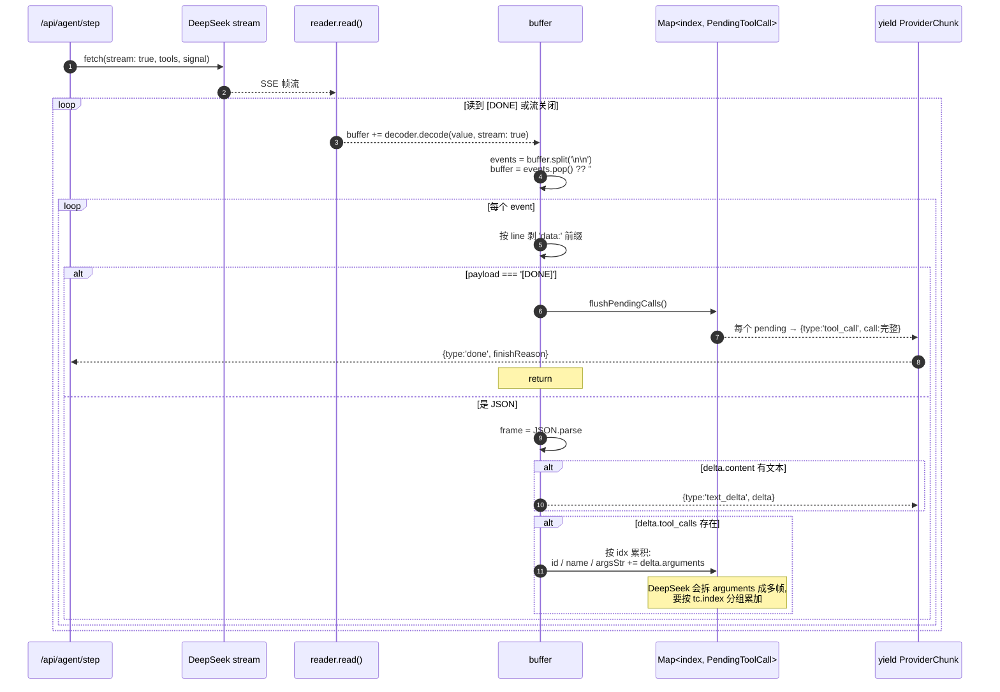

**为什么 tool_call 要"分片拼装"？**

DeepSeek 的 `tool_calls[i].function.arguments` 是 **JSON 字符串按字符流传的**。你会收到类似这样的分片：
```
{"id":"call_xx","function":{"name":"run_tests","arguments":"{"}}
{"function":{"arguments":"\"foo\""}}
{"function":{"arguments":":"}}
{"function":{"arguments":"1}"}}
```
拼装完 `argsStr = '{"foo":1}'` 才能 `JSON.parse`。`Map<index, PendingToolCall>` 里的 `index` 是应对**并发 tool_call**（LLM 一轮返回多个）的关键 —— 每个分片带 `index`，同 index 的累加到同一个桶。

**adapter 内还做了两件"藏坑"的事**：
1. **`args JSON.parse` 藏在 adapter** —— 上层 Loop 拿到直接是对象，不用管字符串
2. **`safeJsonParse` 兜底** —— LLM 有时会塞非法 JSON，包成 `{__unparseable: raw}` 而不是炸整个 stream

---

## 7 · 数据层 · SessionRepo + BYOK

### 7.1 SessionRepo（会话持久化）

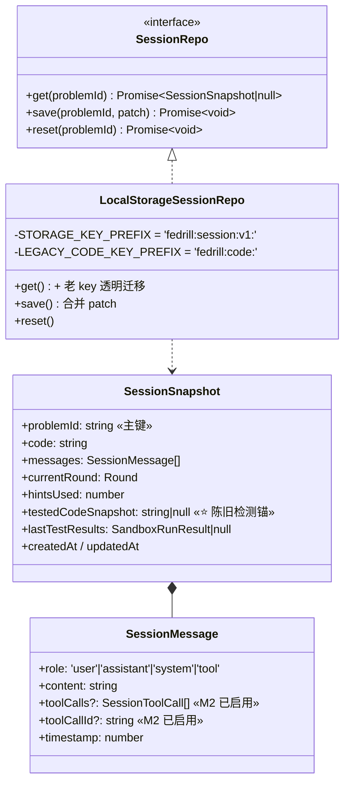

### 7.2 API Key Store（BYOK · [lib/settings/api-key.ts](../lib/settings/api-key.ts)）

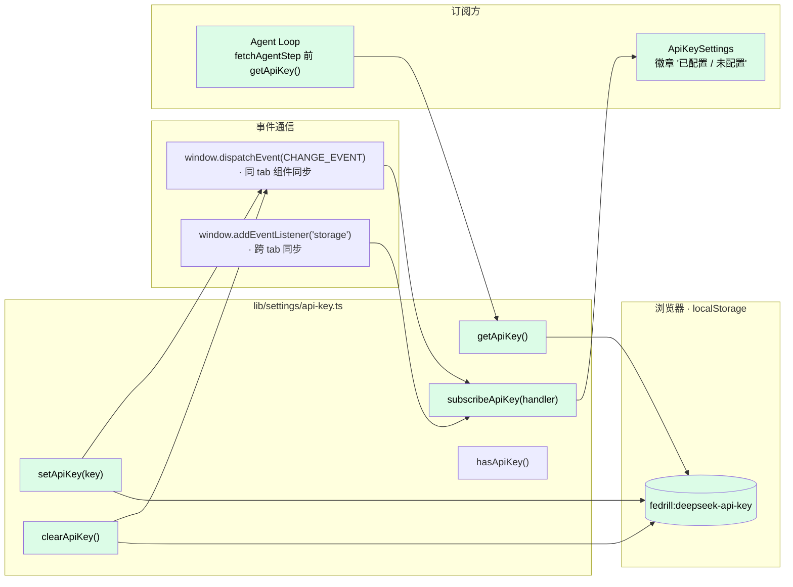

**关键设计**（`3f05488`）：
- **不引状态库**：`localStorage` + 自定义 `CHANGE_EVENT` + `storage` 事件足够
- **subscribe/emit 模式**：徽章能实时反映"已配置 ✓ vs 未配置 · 点这"
- **SSR-safe**：`typeof window` 保护 · 静默降级
- **跨 tab 同步**：用户在另一个 tab 改了 key，本 tab 徽章也刷新

### 7.3 BYOK 端到端数据流

```mermaid
sequenceDiagram
    autonumber
    actor User
    participant AKS as ApiKeySettings 组件
    participant Store as api-key.ts
    participant LS as localStorage
    participant Loop as Agent Loop
    participant Route as /api/agent/step
    participant Env as process.env.DEEPSEEK_API_KEY
    participant DS as DeepSeek

    User->>AKS: 点徽章 → 输入 sk-xxx → 保存
    AKS->>Store: setApiKey('sk-xxx')
    Store->>LS: setItem
    Store->>Store: dispatchEvent(CHANGE_EVENT)
    Store-->>AKS: subscribe 触发 · 徽章变绿

    Note over User,DS: 之后每次对话:
    User->>Loop: 发消息
    Loop->>Store: getApiKey()
    Store-->>Loop: 'sk-xxx' | null
    Loop->>Route: POST + header: x-deepseek-api-key = 'sk-xxx'
    Route->>Route: userApiKey = header || undefined
    Route->>DS: deepseekStream({apiKey: userApiKey, ...})
    Note over DS: adapter 内: apiKey = opts.apiKey ?? env<br/>优先级: BYOK > env
    DS-->>Route: SSE stream
    Route-->>Loop: 逐 chunk 转发
```

**为什么走 header 不走 body？**
- **header 更符合"凭证"语义**（就像 `Authorization`）
- **body 已经承载业务数据**（messages），混入密钥职责不清
- **未来加 CDN 层缓存**时 header 天然不进 body 缓存 key
- **服务端 log 时**默认不打 header，body 会打

---

## 8 · 沙箱层 · Web Worker + 红队防御

### 8.1 沙箱主流程（M1 打底 · 未变）

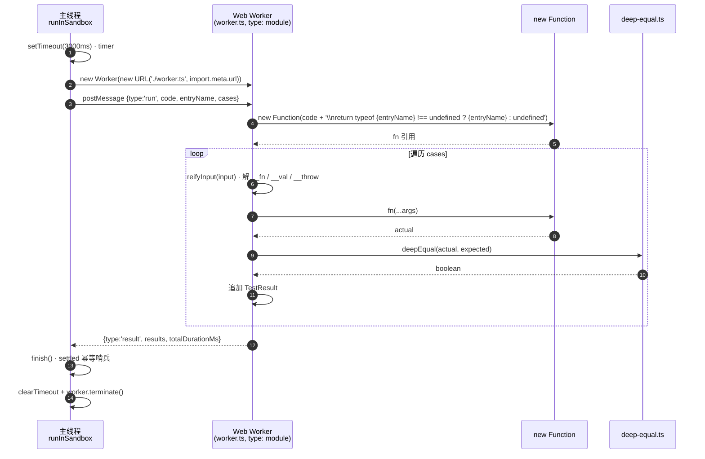

### 8.2 红队防御分层（Step 5 · `a7801fd` · [closure-shadow-and-nonce.md](learning/closure-shadow-and-nonce.md)）

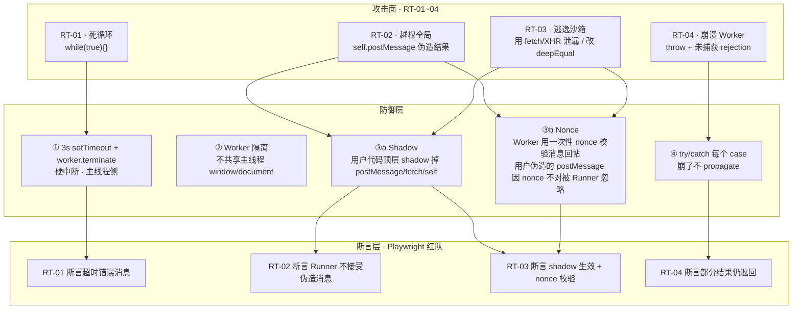

**shadow + nonce 双层防御要点**（面试可讲）：
- **Shadow**：Worker 在跑用户代码前，用 `const postMessage = undefined` 等把危险 API 顶层遮蔽 —— 用户代码里再引用 `postMessage` 拿到的是 `undefined`（不是 Worker 的 `self.postMessage`）
- **Nonce**：Runner 每次 postMessage 附一个随机 nonce，Worker 回帖时带上，Runner 端校验 —— 即使 shadow 被绕过，伪造的消息 nonce 对不上也会被丢弃

---

## 9 · 质量层 · Vitest + Playwright

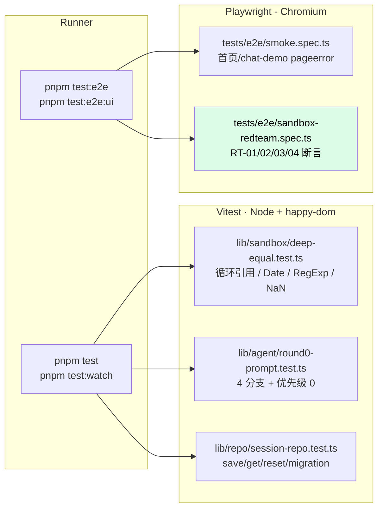

**AI 参与测试的三档自治**（[ADR-009](decisions/009-ai-test-autonomy-tiers.md)）：
- **Tier 1 冒烟**：AI 可自动跑（smoke · red team）
- **Tier 2 业务流**：AI 起草人审（M2b 接 Playwright MCP）
- **Tier 3 Loop 内部**：只人写单测（LLM 有不确定性 · 不适合 E2E 断言）

---

## 10 · 流量 1 · 用户手动跑测试

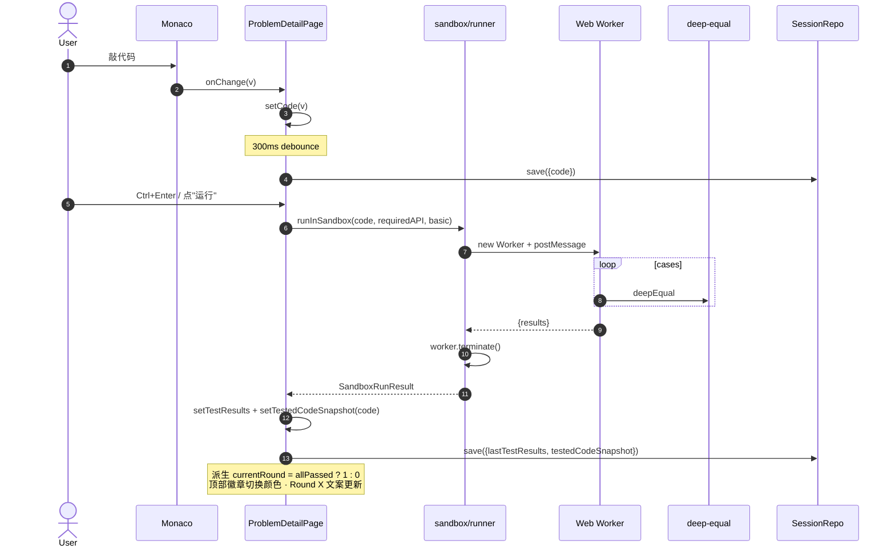

---

## 11 · 流量 2 · Agent 主动 tool_call（M2a 核心）

**这是 M2a 简历最亮的一条流量**。9 个 actor，14 步端到端。

```mermaid
sequenceDiagram
    autonumber
    actor User
    participant Page as UI State<br/>problems/[id]/page.tsx
    participant Loop as Agent Loop<br/>lib/agent/loop.ts
    participant Route as /api/agent/step<br/>无状态代理
    participant DS_Adapter as deepseekStream<br/>lib/llm/deepseek.ts
    participant DS as DeepSeek Cloud
    participant Tool as executeRunTests
    participant Runner as sandbox/runner
    participant Repo as SessionRepo

    User->>Page: 输入"我这里挂了"→ Enter
    Page->>Page: 派生 currentRound → 组 systemPrompt(Round 0 or 1)
    Page->>Page: initialMessages = [system + history + 新 user]
    Page->>Loop: runAgentLoop({problemId, initialMessages, signal})

    rect rgb(255, 250, 230)
    Note over Loop,DS: 迭代 1 · LLM 决定调 tool
    Loop->>Route: POST + header:x-deepseek-api-key + signal
    Route->>DS_Adapter: deepseekStream({messages, tools:[run_tests], signal})
    DS_Adapter->>DS: fetch(stream:true, tools, Bearer)
    DS-->>DS_Adapter: SSE 帧流 (delta.tool_calls 分片)
    DS_Adapter->>DS_Adapter: Map<idx, PendingToolCall><br/>累积 id/name/argsStr
    DS-->>DS_Adapter: data: [DONE]
    DS_Adapter->>DS_Adapter: flushPendingCalls → 完整 tool_call
    DS_Adapter-->>Route: yield {type:'tool_call', call}
    Route-->>Loop: SSE data:{type:'tool_call'}
    Loop-->>Page: yield {type:'tool_call'}
    Page->>Page: 插入 pending Tool Card
    end

    rect rgb(230, 250, 235)
    Note over Loop,Runner: Loop 在客户端本地执行 tool
    Loop->>Tool: executeRunTests(problemId)
    Tool->>Repo: get(problemId) → code
    Tool->>Runner: runInSandbox(code, requiredAPI, basic)
    Runner-->>Tool: SandboxRunResult
    Tool->>Repo: save({lastTestResults, testedCodeSnapshot})
    Tool-->>Loop: RunTestsResult
    Loop->>Loop: messages.push({role:'tool', content:JSON.stringify(result), toolCallId})
    Loop-->>Page: yield {type:'tool_result'}
    Page->>Page: Card pending → done · 拉 repo 同步 testResults
    end

    rect rgb(240, 240, 255)
    Note over Loop,DS: 迭代 2 · LLM 基于 tool_result 说话
    Loop->>Route: POST (新 messages 含 role='tool')
    Route->>DS_Adapter: deepseekStream
    DS_Adapter->>DS: 上游
    DS-->>DS_Adapter: 只有 delta.content (无 tool_calls)
    DS_Adapter-->>Loop: 逐 chunk text_delta
    Loop-->>Page: yield text_delta (多次)
    Page->>Page: 追加到 assistant 气泡
    DS-->>DS_Adapter: [DONE]
    Loop->>Loop: toolCallsBuf.length === 0 → break
    Loop-->>Page: yield {type:'done', reason:'stop'}
    end

    Page->>Repo: save({messages}) · 300ms debounce
```

**关键设计点**：
1. **Loop 在客户端**（ADR-011）—— 服务端不知道 tool 存不存在，只是转发 `tools spec`
2. **Tool 执行也在客户端** —— 复用 M1 Web Worker
3. **`role='tool'` 消息拼回 messages** —— 下一次 POST 时带上，LLM 才能"看到"结果
4. **`toolCallId` 引用** —— OpenAI 兼容协议要求，adapter 转成 wire format 时映射
5. **副作用同步 UI 面板** —— Tool 内部写 Repo，UI 从 Repo 拉回来 → AI 触发 vs 用户点按钮语义一致

---

## 12 · 流量 3 · AbortController 端到端中断

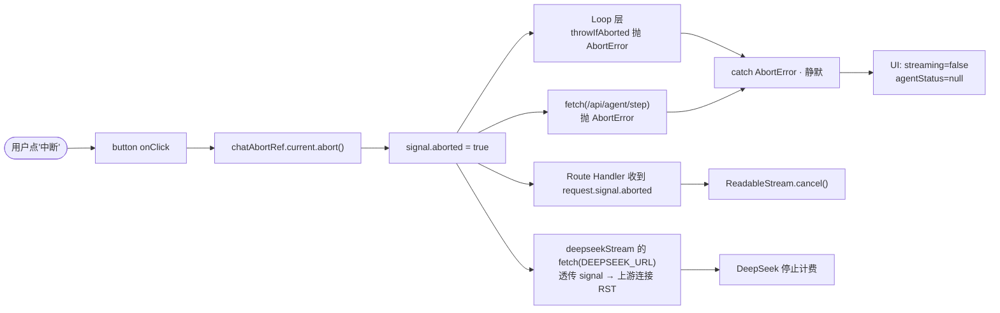

**四层同时收到 abort 信号**：
1. Loop 层 `for await` 抛 `AbortError`
2. 客户端 `fetch(/api/agent/step)` 抛
3. 服务端 `request.signal` 触发 `ReadableStream.cancel()`
4. 服务端上游 `fetch(DEEPSEEK_URL, {signal: request.signal})` 抛 → 上游 TCP RST → **DeepSeek 立即停止计费**

**一个 AbortController 管四层** —— 这就是 ADR-011 说的 "客户端主导天然可断" 的具体展开。

---

## 13 · 流量 4 · BYOK 密钥流

见 [7.3 BYOK 端到端数据流](#73-byok-端到端数据流)。

---

## 14 · 关键设计决策矩阵（11 份 ADR）

| ADR | 主题 | 决定 | 面试挂钩问题 |
|---|---|---|---|
| [001](decisions/001-choose-ai-sdk.md) | AI SDK 选型 | 不用 Vercel AI SDK · 手写 | "为什么不用 SDK？" |
| [002](decisions/002-hand-rolled-vs-sdk-agent.md) | Agent 实现 | 手写 vs SDK | "SDK 藏了什么？" |
| [004](decisions/004-agent-loop-vs-langchain.md) | 拒绝 LangChain | 手写 200 行搞定 ReAct | "为什么不用 LangChain？" |
| [006](decisions/006-sandbox-vs-oj.md) | 沙箱 | Web Worker vs Piston/OJ | "手撕题为什么不接 OJ？" |
| [009](decisions/009-ai-test-autonomy-tiers.md) | AI 测试自治分级 | 三档 Tier 1/2/3 | "Agent Loop 怎么测？" |
| [010](decisions/010-playwright-e2e.md) | E2E 选 Playwright | 只 chromium · trace on-first-retry | "为什么只装 chromium？" |
| [011](decisions/011-client-side-agent-loop.md) ⭐ | Agent Loop 位置 | **客户端跑 Loop + 服务端无状态代理** | "Loop 放哪？" |

---

## 15 · 面试话术钩子（速查）

### Q1 · 你的 Agent Loop 怎么实现的？

**一句话**：ReAct 循环在**客户端**跑（[ADR-011](decisions/011-client-side-agent-loop.md)），服务端只做无状态 LLM 代理。`while(iter < 10)` + 每轮消费 `/api/agent/step` 的 SSE → 拿到 `tool_call` 就本地执行 → 结果 push 成 `role='tool'` 消息 → 回到循环。

**为什么客户端**：
- Web Worker 沙箱天生浏览器专属，搬服务端要引入 vm2/isolated-vm（重复造轮子）
- AbortController 端到端一条链，四层同时断
- 服务端无状态可无限水平扩

### Q2 · 服务端 `/api/agent/step` 做了什么？

**极薄**：接收 `{messages, tools}` + `x-deepseek-api-key` header → 调 `deepseekStream()` → 逐 chunk 转 SSE（`data: {JSON}\n\n`）→ 结束发 `[DONE]`。**不管 loop、不管 tool、不管 session**。

### Q3 · DeepSeek 的 tool_call 是分片的，你怎么拼？

`deepseekStream` 里维护一个 `Map<index, PendingToolCall>`。每帧的 `delta.tool_calls[i]` 有 `index` 字段，按 index 累加 `id`/`name`/`argsStr`。收到 `[DONE]` 前 `flushPendingCalls` —— `JSON.parse(argsStr)` 得到完整 `args`（用 `safeJsonParse` 兜非法 JSON），yield 出完整 `ProviderToolCall`。

### Q4 · Provider 抽象层的意义？

上层 `runAgentLoop` 不知道底层是 DeepSeek 还是 Claude。M2b 加 Anthropic 只写 `anthropicStream()`（另一个协议：`role='user'` 内嵌 `tool_result`），loop 一行不改。ADR-002 落地。

### Q5 · Tool 结果失败为什么不 throw？

Tool 执行体返回 `{success: false, error: '...'}`（包装错误）。塞进 `role='tool'` 消息内容里，**LLM 有机会看到错误自我纠正**（比如换个参数重试或向用户解释）。throw 会炸掉整个 loop，等于把 recovery 能力交出去了。

### Q6 · AbortController 一共传导几层？

**四层**：
1. Loop 的 `throwIfAborted(signal)` 循环开头检查
2. 客户端 `fetch(/api/agent/step, {signal})`
3. 服务端 `request.signal` 传给 `deepseekStream`
4. Adapter 内 `fetch(DEEPSEEK_URL, {signal})` → 上游 TCP RST → DeepSeek 停止计费

### Q7 · Prompt 为什么在客户端组装？

因为 UI state 就在客户端 —— code / testResults / testedCodeSnapshot 是权威事实。服务端要拿这些数据得反查 session（多一次 IO），且和 ADR-011 "服务端无状态" 冲突。客户端组好再 POST，简单直接。

### Q8 · currentRound 为什么是派生量？

`currentRound = allPassed ? 1 : 0`。**单一事实源是 testResults**。存 state 会产生"currentRound=1 但测试其实挂了"的双源风险 —— 派生就没这个问题。这是 React "state 最小化" 原则的教科书应用。

### Q9 · 沙箱红队防御做了什么？

四层：
1. `setTimeout(3000) + worker.terminate()` 硬中断死循环（RT-01）
2. Worker 隔离 · 用户拿不到 window/document（RT-02/03 部分）
3. **Shadow + Nonce**（RT-03）—— Worker 内 shadow `postMessage/fetch/self`；Runner 每次消息附 nonce，回帖校验，伪造消息被丢
4. `try/catch` 每个 case · 崩了返回部分结果（RT-04）

详见 [closure-shadow-and-nonce.md](learning/closure-shadow-and-nonce.md)。

### Q10 · BYOK 为什么走 header？

- 语义匹配：header 是"凭证"，body 是"业务"
- Log 隔离：默认 log 不打 header
- CDN 缓存友好：header 不进 body cache key
- 优先级：`opts.apiKey ?? process.env.DEEPSEEK_API_KEY`，BYOK 覆盖 env，本地 dev 只配 env 也能跑

### Q11 · Tool Card UI 为什么区分 pending/done/error？

**信号透明**：
- pending 琥珀脉冲 —— "AI 正在跑测试，等一下"
- done 绿色 · 展开显示 pass/total 明细
- error 红底 · 立刻能看到失败原因

用户能**看到"AI 在做什么"**，不是黑盒。这也是 Agentic UX 的核心 —— trace 可见。

---

## 16 · 记忆锚点表

| 主题 | 一句话 |
|---|---|
| **整体** | 六层 · Client Agent Loop + 服务端无状态代理 (ADR-011) |
| **Agent Loop** | while + `MAX_ITERATIONS=10` + AsyncGenerator 吐 5 种 AgentEvent |
| **Provider 抽象** | ProviderChunk/Message/ToolCall/ToolSpec · DeepSeek adapter 藏协议 |
| **tool_call 拼装** | `Map<index, PendingToolCall>` + [DONE] 前 flush |
| **SSE** | `split('\n\n')` + `events.pop()` 兜半截 · `stream:true` 保多字节 |
| **Round 状态** | `currentRound = allPassed ? 1 : 0` · 派生非 state |
| **Prompt** | 5 布尔在客户端算好塞给 LLM · 反幻觉护栏 |
| **Tool 设计** | 参数最少 · 不 throw · 结构化结果 · description 决定命中率 |
| **Sandbox** | 每次新建 + terminate · shadow + nonce 双层防御 |
| **Repo** | 接口先定 · testedCodeSnapshot 陈旧检测 · 老 key 透明迁移 |
| **BYOK** | localStorage + header · subscribe/emit · SSR-safe |
| **Abort** | 一个 AbortController 管四层 · 上游连接 RST 停计费 |
| **测试** | Vitest co-located · Playwright 独立 · AI 测试三档自治 |

---

## 简历三条硬亮点（配图 · 面试直接讲）

1. **手写 LLM Harness**（第 5.2 + 第 6 + 第 12 节）
   - SSE 帧解析 + tool_call 分片拼装 + Provider 抽象（可换 Claude）
   - AbortController 四层端到端

2. **手写客户端 Agent Loop（ADR-011）**（第 5.1 + 第 11 节）
   - ReAct + `MAX_ITERATIONS=10` + `AsyncGenerator<AgentEvent>` + 5 种事件
   - 服务端无状态可水平扩

3. **Web Worker 沙盒 + 红队防御**（第 8 节）
   - `terminate` 硬中断 + `{__fn}/{__val}` escape hatch
   - Shadow + Nonce 双层防御（Step 5 RT-03）

---

## 相关文档

- [README.md](../README.md) — 项目总览 + 进度
- [roadmap-m2.md](roadmap-m2.md) — M2 冲刺计划
- [技术方案.md](技术方案.md) — 技术蓝图
- [decisions/](decisions/) — 11 份 ADR
- [learning/](learning/) — 8 篇学习笔记

## 变更记录

| 日期 | 版本 | 变更 |
| --- | --- | --- |
| 2026-08-31 | v1.0 | 初版 · 9 张图 · M1 + Phase 0 + M2a 规划 |
| 2026-09-05 | v2.0 | 大改版 · 按"层 × 数据流 × Agent 设计"三视角组织 · 覆盖 M2a Phase 1a + 红队 Step 5 + BYOK |
